# From Zero to 3D — From 3D to a Game

**Visual Analytics seminar · Student walkthrough · Revised 21 September 2026**

Create a planet and a rocket in Blender, render them together, and build an interactive orbit experiment in Godot. You will choose the rocket's starting position and velocity, observe its trajectory, and change it with thrust.

| Time | Activity | Result |
| --- | --- | --- |
| 00–05 | Introduction and target demonstration | Understand the asset-to-game workflow |
| 05–60 | Task 1.A — Blender | Models, materials, rendered image, and GLB exports |
| 60–85 | Task 1.B — Godot | Game scene, lighting, sky, and collision shapes |
| 85–115 | Task 1.C — Simulation | Launch, gravity, steering, thrust, and collision |
| 115–120 | Save and discuss | Explain one observed trajectory |

> [!NOTE]
> Complete installation and project setup before class. The two-hour schedule assumes a guided walkthrough and copy-paste code. Detailed styling and the optional VOXON demonstration can continue afterwards.

This file is the complete walkthrough and the document to edit. The screenshots are examples from the practical run. Some show earlier filenames or folder layouts; use the consistent names and paths specified in the text.

## Contents

- [Before the workshop](#before-the-workshop)
- [Task 1.A — Create, render, and export the models in Blender](#task-1a--create-render-and-export-the-models-in-blender)
- [Task 1.B — Prepare the physical scenes in Godot](#task-1b--prepare-the-physical-scenes-in-godot)
- [Task 1.C — Add control logic and simulate the orbit](#task-1c--add-control-logic-and-simulate-the-orbit)
- [Save and push your work](#save-and-push-your-work)
- [Assets and material recipes](#assets-and-material-recipes)
- [Optional extension — VOXON](#optional-extension--voxon)

---

## Before the workshop

### Required software

| Tool | Workshop target | Check before class |
| --- | --- | --- |
| Blender | 5.2.x | Starts and can save a `.blend` file |
| Godot | 4.7 **.NET edition** | C# is available when attaching a script |
| .NET SDK | 10, matching your CPU architecture | `dotnet --list-sdks` includes a 10.x SDK |
| JetBrains Rider | A current version with Godot support | Opens the Godot C# project |
| Git | Installed and authenticated for the student repository | Can clone and later push your work |
| Three-button mouse | Recommended | Middle-button navigation works |

> [!NOTE]
> The supplied screenshots were captured with **Blender 5.2.1** and **Godot 4.6.3 .NET**. Godot 4.7 .NET remains the target specified for the workshop; use the release announced for the class and complete the setup check below with that release.

Use the [.NET edition of Godot](https://godotengine.org/download/) for the release announced in class and install the [.NET SDK](https://dotnet.microsoft.com/en-us/download/dotnet/10.0) separately. A runtime-only installation cannot compile the scripts. BlenderKit's free tier is optional: the required atlas and sky are already supplied.

### Get the teaching materials and your working repository

We use two repositories:

| Repository | Purpose | What you change |
| --- | --- | --- |
| [VisA-3D teaching materials](https://github.com/unibas-space/VisA-3D) | This walkthrough, screenshots, textures, and reference code | Read and copy the supplied resources |
| Student repository — URL supplied in class | Your Blender assets and Godot project | Work in your own named folders and push your progress |

Clone the teaching materials:

```bash
git clone https://github.com/unibas-space/VisA-3D.git
```

Clone the separate student repository alongside it. **Replace `STUDENT_REPOSITORY_URL` with the actual URL before running this command.**

```bash
git clone STUDENT_REPOSITORY_URL visa-student-work
```

Use the branch announced in class. Inside the student repository, create **`Name-Lastname-blender`** and **`Name-Lastname-godot`**, replacing `Name-Lastname` with your own name. Use hyphens and avoid spaces in these folder names.

Copy the complete **`assets/` directory** from the teaching materials into **`Name-Lastname-blender/assets/`**. This keeps the Blender files and their image dependencies together. Also create `exports/` and `renders/` inside your Blender folder.

| Student-repository path | Contents |
| --- | --- |
| `Name-Lastname-blender/assets/` | Copy of the supplied textures, sky, and material presets; later your baked planet image |
| `Name-Lastname-blender/planet.blend` | Planet geometry and material |
| `Name-Lastname-blender/rocket.blend` | Editable rocket parts and a separate export mesh |
| `Name-Lastname-blender/showcase.blend` | Composition, camera, lighting, and sky |
| `Name-Lastname-blender/exports/` | GLB files exported from Blender |
| `Name-Lastname-blender/renders/` | Rendered PNG |
| `Name-Lastname-godot/` | Your complete Godot project |

> [!IMPORTANT]
> In Blender steps, paths such as `assets/textures/...` are relative to **your Blender folder**. In Godot, `res://` means **your Godot project folder**. Images in this document remain in the teaching repository's `doc-assets/`; they are not game assets.

### Create the final Godot project and check C#

Create the project you will use throughout the workshop. You will return to the same project after modelling.

1. Open the **.NET edition** of Godot and choose **Create**. Name the project **VisA-Name-Lastname**.
2. Set Project Path to your existing **`Name-Lastname-godot`** folder inside the student repository. Disable automatic folder creation if it would add another nested folder.
3. Choose **Forward+**. Set **Version Control Metadata to None**; Git is managed at the student repository root, and we add the project exclusions in the final saving step.
4. Click **Create & Edit**.

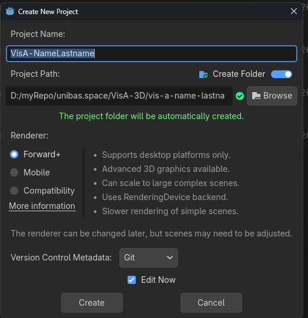

*Create the final workshop project with Forward+. Use your named student folder and set Version Control Metadata to None; the earlier screenshot still shows Git.*

> [!TIP]
> If Forward+ does not start on your laptop, use Compatibility for the same project and tell the instructor. Keep Forward+ when the setup check works.

5. Create a scene using **Other Node → Node** and name the root **SetupCheck**. Save it as `res://setup_check.tscn`.
6. Select the root and choose **Attach Script**. Set Language to **C#**, keep Inherits as **Node**, and set the file path to **`res://SetupCheck.cs`**. Godot creates the C# project and solution.


*Choose C# and Node inheritance. Before creating the script, change the default path shown here from Node.cs to SetupCheck.cs.*

7. Replace the generated script with the following:

```csharp
using Godot;

public partial class SetupCheck : Node
{
    public override void _Ready()
    {
        GD.Print("C# workshop setup works.");
    }
}
```

8. Build the project and run the current scene with **F6**. Confirm the message in the Output panel.
9. In **Editor → Editor Settings → Dotnet → Editor**, set **External Editor** to **JetBrains Rider** and open the script.
10. Keep this project for the workshop. Resolve any package restore or missing-runtime error now; use the runtime named in the error if the generated project targets an older version.

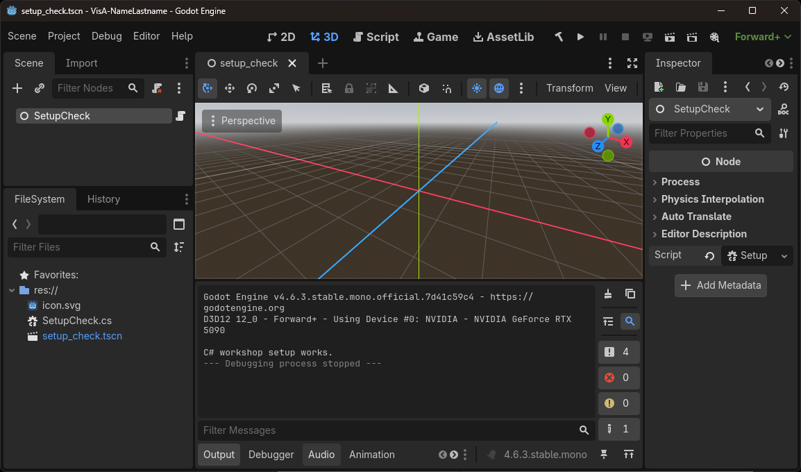

*The Output panel confirms that C# builds and runs. This capture also records the rehearsal version: Godot 4.6.3 .NET.*

> [!IMPORTANT]
> A successful build and run is the setup check. Rider alone does not provide the .NET SDK. Godot's exported C# fields become visible after a successful build. See [Godot's C# setup documentation](https://docs.godotengine.org/en/stable/tutorials/scripting/c_sharp/c_sharp_basics.html).

### Editor conventions

The walkthrough uses English UI labels and default shortcuts. Blender shortcuts apply to the editor under the pointer. Decimal values use a dot. Without a numpad, use the viewport axis gizmo or **View → Viewpoint**. Save regularly with **Ctrl+S**.

---

## Task 1.A — Create, render, and export the models in Blender

**Time target: approximately 55 minutes.** You need Blender and the copied assets in your named Blender folder. Your outputs are two models, a separate composition scene, a rendered PNG, and two GLB files.

### A1. Learn the controls we need

Start with **File → New → General**.

| Action | Command / shortcut |
| --- | --- |
| Select / select all | Left-click / A |
| Orbit / pan / zoom | Middle mouse / Shift + middle mouse / mouse wheel |
| Move / rotate / scale | G / R / S |
| Constrain a transform | X, Y, or Z after G, R, or S |
| Confirm / cancel | Enter / Esc |
| Toggle Object Mode / Edit Mode | Tab |
| Add an object or a shader node | Shift+A in the relevant editor |
| Search a command | F3, then type its name |
| Apply object transforms | Ctrl+A in Object Mode, then choose the transform |
| Duplicate selected objects | Shift+D |
| Open the sidebar | N |
| Frame the selected object | Numpad decimal, or View → Frame Selected |

Object Mode changes complete objects. Edit Mode changes their vertices, edges, and faces. A **mesh** defines the shape; a **material** defines how its surface interacts with light; an image **texture** stores values such as color; **UV coordinates** tell the material where to read that image.

> [!TIP]
> Global axes belong to the scene; local axes follow an object's orientation. With the default Global transform orientation, **G, Z** moves along global Z, while **G, Z, Z** moves along the object's local Z. The same distinction applies to rotation and scale.

### A2. Create the planet

Aim for a simple colored sphere such as the one below. You can vary the colors and patch sizes; keep the radius and origin consistent so the later physics setup matches.

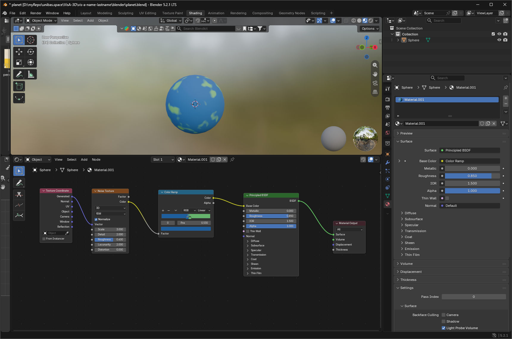

*A possible planet result. The exact patch distribution depends on your noise and ramp settings; you can choose a different palette.*

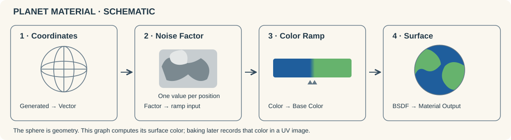

*The material reads a position, calculates a noise value, maps that value to a color, and shades the sphere. The mesh supplies the geometry independently of this graph.*

#### Model the sphere

1. In the 3D viewport, press **A** to select the default objects, then **X → Delete**.
2. Use **Shift+A → Mesh → UV Sphere**. Immediately open **Adjust Last Operation** with **F9**, or expand the panel at the bottom-left.
3. Set **Segments 32**, **Ring Count 16**, and **Radius 2**. Keep Location `(0, 0, 0)`.
4. Rename the object **Planet** in the Outliner. Right-click → **Shade Smooth**.
5. In Object Mode, use **Ctrl+A → Scale**: this is the **Apply Scale** command. Press **N** and open **Item** to check Scale `(1, 1, 1)` and Dimensions approximately `(4, 4, 4)`.
6. Save as **`Name-Lastname-blender/planet.blend`**.

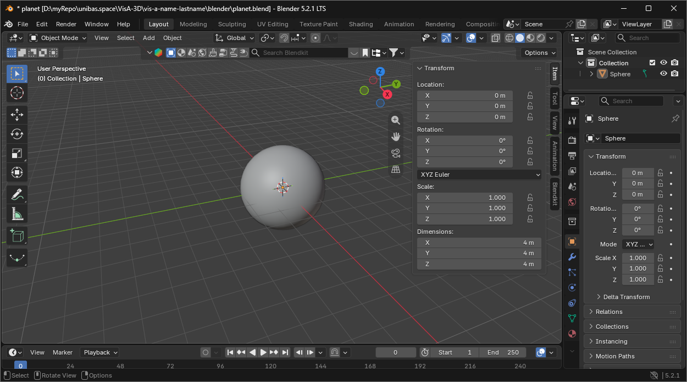

*Check the sphere dimensions and unit scale in the Item sidebar. Rename the object Planet even if the screenshot still uses Sphere.*

> [!NOTE]
> Applying scale keeps the visible size but records it in the mesh, leaving object scale at one. Shade Smooth changes the interpolated surface shading; it does not add polygons. The UV Sphere also comes with a UV map for the later bake.

#### Create and connect the material

1. Select Planet and open the **Shading** workspace.
2. In the Shader Editor header, keep the context at **Object** and click **New**. If a material already exists, use it. Rename it **PlanetSurface** in the material name field.
3. Keep the **Principled BSDF** and **Material Output** nodes and their existing connection.

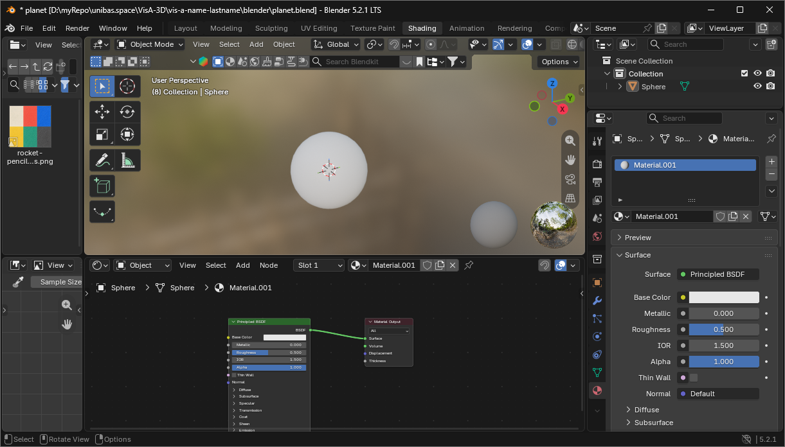

*A new material starts with Principled BSDF connected to Material Output. Name it PlanetSurface before adding the procedural nodes.*

4. With the pointer over the Shader Editor, press **Shift+A**, choose **Search**, and type **Texture Coordinate**. Click to place the node. Repeat for **Noise Texture** and **Color Ramp**. F3 also opens command search.
5. Drag from each output socket to the corresponding input:

| Output | Input | Meaning |
| --- | --- | --- |
| Texture Coordinate: **Generated** | Noise Texture: **Vector** | Read a position within the object's bounds |
| Noise Texture: **Factor** / **Fac** | Color Ramp: **Factor** / **Fac** | Convert the noise value to a chosen color |
| Color Ramp: **Color** | Principled BSDF: **Base Color** | Use that color on the surface |
| Principled BSDF: **BSDF** | Material Output: **Surface** | Send the material to the renderer |

6. Set Noise to **3D**, Scale **3.0**, Detail **2.0**, Roughness **0.6**, Distortion **0**. Keep the other defaults.
7. In the Color Ramp, keep **Linear** interpolation. Select the left stop, set Position **0.47**, click its color field, and enter **`#1F5E9C`**. Select the right stop and set Position **0.53**, color **`#66B36D`**. If Blender expects eight hex digits, append `FF` for full opacity.
8. On Principled BSDF, set **Metallic 0**, **Roughness 0.85**, and **Alpha 1**.
9. Choose **Material Preview** using the viewport shading buttons at the top-right. Save.


*The material graph from the practical run. Follow the socket correction below when reproducing the reference recipe.*

> [!IMPORTANT]
> For the recipe above, connect Noise Texture's **gray Factor output** to the ramp. The screenshot uses its yellow Color output, which Blender converts to a value; that is a different variation. Use the table and overview diagram as the wiring reference.

Think of the graph as a sequence of functions: coordinates become a numerical pattern, the ramp maps numbers to colors, and the shader determines the visible surface. Roughness controls how broad or sharp reflections appear.

#### Make it your own

Choose different ramp colors or Noise Scale. These four starting points use the same graph and stop positions:

| Variant | Noise Scale | Left stop | Right stop |
| --- | --- | --- | --- |
| Ocean | 3.0 | `#1F5E9C` | `#66B36D` |
| Rust | 4.5 | `#8F392F` | `#E9B979` |
| Ice | 2.8 | `#466A92` | `#D9F2EE` |
| Candy | 3.8 | `#68418F` | `#EE9CAF` |

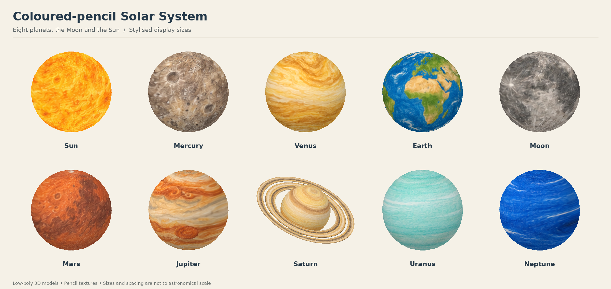

*Planet design references: explore colors and surface patterns while keeping the workshop geometry simple.*

> [!TIP]
> The reference illustration is inspiration, not a requirement to reproduce rings, craters, or detailed continents. Your two-color procedural planet is sufficient. Keep radius **2** and the origin at `(0, 0, 0)`.

**Checkpoint:** A colored planet is saved in `planet.blend`.

### A3. Build the rocket in a separate file

Use the illustration as a design direction. Our version uses a cylinder, cone, nozzle, and **three fins distributed around the body**.


*Design reference for the rocket. The workshop model simplifies this illustration into primitive meshes and three repeated fins.*

#### Create the main parts and one fin

1. Save the planet, then choose **File → New → General** and delete the default objects.
2. Use **Shift+S → Cursor to World Origin**. Rename the default collection **RocketSource**.
3. Add the following parts. Enter cylinder/cone parameters with **F9 immediately after adding**, and locations/dimensions in the **N → Item** panel. The rocket points along Blender's **+Z** axis.

| Part | Primitive | Settings | Location |
| --- | --- | --- | --- |
| `Body` | Cylinder | 16 vertices; radius **0.30**; depth **1.20** | `(0, 0, 0)` |
| `Nose` | Cone | 16 vertices; Radius 1 **0.30**; Radius 2 **0**; depth **0.50** | `(0, 0, 0.85)` |
| `Nozzle` | Cylinder | 12 vertices; radius **0.18**; depth **0.20** | `(0, 0, -0.70)` |
| `Fin` | Cube | Dimensions **`(0.40, 0.10, 0.55)`** | `(0.38, 0, -0.38)` |


*Block out the body, nose, nozzle, and one fin before shaping or repeating the fin.*

4. Select all mesh parts and use **Ctrl+A → Scale**. Each should now have Scale `(1, 1, 1)`.

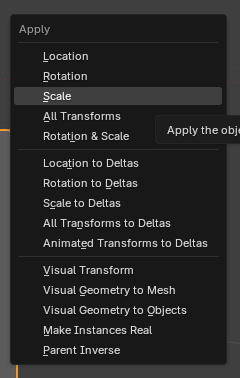

*Apply Scale in Object Mode before bevels and the radial array, keeping the visible dimensions unchanged.*

> [!TIP]
> **Precise placement:** use the numeric locations above first. For free modelling, the magnet in the viewport header enables snapping; its dropdown selects targets such as Vertex, Edge, or Face. With snapping off, hold **Ctrl while moving with G** to enable it temporarily. Object Mode snaps a reference point of the object, so use **Edit Mode vertex snapping** when you need a specific vertex to meet another vertex. Turn snapping off again for the numerical recipe.

#### Shape and bevel the fin in Edit Mode

1. Select only Fin. Press **Tab** for Edit Mode, **1** for Vertex Select, and **Numpad 1** for Front View. Enable **X-Ray with Alt+Z** so a box selection reaches both sides of the thin fin.
2. Deselect with **Alt+A**. Use **B** to box-select the two vertices at the **outer upper corner**: the rightmost top corner in this view, including front and back vertices.
3. Press **G, X, -0.20, Enter** to pull that corner towards the body. The fin now has a sloping outer edge.
4. Press **2** for Edge Select and **A** to select all edges. Press **Ctrl+B** for **Bevel**, enter **0.01**, and confirm. Use one or two segments; the mouse wheel adjusts the segment count during the operation.
5. Turn X-Ray off and return to Object Mode with Tab.

> [!NOTE]
> **Ctrl+B in Edit Mode changes the mesh.** A Bevel modifier keeps the bevel adjustable. We use the first on the fin to practise mesh editing and the second on the body below.

#### Make three fins with an Array modifier

The array will rotate copies around the rocket's center, not around the fin's own center.

1. With Fin selected in Object Mode, confirm the 3D cursor is at the world origin. Use **Object → Set Origin → Origin to 3D Cursor**. The visible fin stays in place, but its origin moves to the rocket center.
2. Add **Shift+A → Empty → Plain Axes** at the world origin. Name it **FinRotation** and set its **Z rotation to 120°**. Keep Location zero and Scale one.
3. Select Fin. Open the **Modifiers** tab, choose **Add Modifier**, and search for **Array**.
4. Set Count to **3**. Disable **Relative Offset** and **Constant Offset**. Enable **Object Offset** and select **FinRotation** as the offset object.
5. Inspect from above: the fins should be separated by **120°**. Keep the modifier unapplied in the source model.


*The original fin and two rotated copies share the rocket center. The fin origin and offset Empty must be at that center, with unit scale.*

> [!TIP]
> If the copies form a spiral or change size, check the fin and Empty origins, scale, and offset settings. Only the Empty's Z rotation should provide the repeated transform.

#### Add a small amount of surface detail

1. Select Body and add a **Bevel modifier**. Use Amount **0.02**, Segments **2**, and Limit Method **Angle** with approximately **30°**. This softens the end rims while retaining the simple cylinder.
2. Optionally add a porthole: a UV Sphere with radius **0.16**, located at `(0, -0.29, 0.20)`, and scaled to `(1, 0.25, 1)`. Apply its scale and name it **Window**.
3. Keep the other details simple and save as **`Name-Lastname-blender/rocket.blend`**.


*Recognizable rocket geometry before texturing. The three-fin array gives an even arrangement around the body.*

**Checkpoint:** The source collection contains separate, editable parts and the fin array. The reference screenshot shows the general silhouette; your bevels and fin shape can differ.

### A4. Apply the pencil texture and prepare an export mesh

#### Create one shared material

1. Select Body and open **Shading**. Click **New** to create **RocketPencil**.
2. Add an **Image Texture** node and open your local **`assets/textures/rocket-pencil-atlas.png`**.
3. Keep Color Space at **sRGB**. Connect **Image Texture Color → Principled Base Color**. Set Metallic **0**, Roughness **0.85**, Alpha **1**.
4. For Nose, Nozzle, Fin, and the optional Window, choose **RocketPencil** from the existing-material dropdown beside **New**. Reuse the material rather than creating a copy for each part.

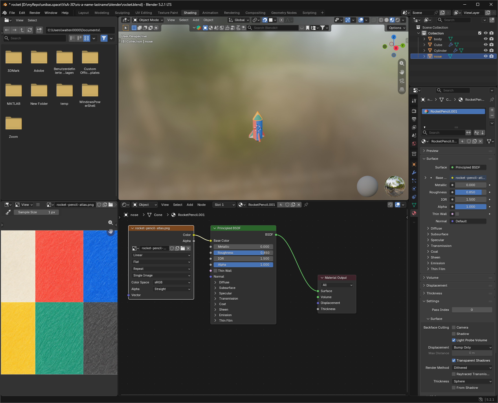

*The same image-based RocketPencil material can be shared by all rocket parts; their UVs choose different color patches.*

#### Move each part's UVs into a color

UVs are positions in the image. We use the atlas as a collection of colored pencil surfaces; choose any color for each part.

1. Select a part in Object Mode and switch to **UV Editing**.
2. With the pointer over the **3D viewport**, press Tab, then A. Use **U → Smart UV Project** and confirm.
3. In the **UV Editor**, choose `rocket-pencil-atlas.png` from the image dropdown. Press A to select all of the part's UVs. Keep the pivot at **Median Point**.
4. Press **S**, type **0.2**, and press Enter. This shrinks all selected UVs together.
5. Press **G** and move the UVs visually into your chosen color patch. Left-click or Enter confirms. Use G again to adjust, or S to make the group smaller.
6. Check that **all islands are inside one patch with a clear margin**. Do not place them across a boundary between colors.
7. Return to Object Mode in the 3D viewport and repeat for the next part. The Array copies inherit the original fin's UVs.

> [!TIP]
> No exact UV coordinates are needed. If every color appears on one part, its UVs still cover the whole atlas. If another part's UVs move too, return to Object Mode and select only the intended part before entering Edit Mode.

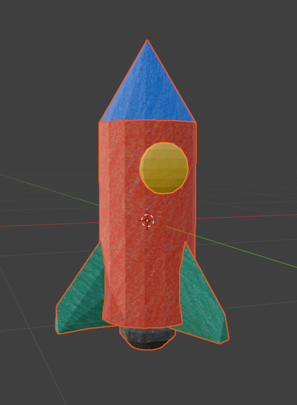

*One possible color arrangement after UV placement. Choose your own colors; the optional window samples another atlas patch.*

#### Keep the source editable and create a separate export object

Keep both representations in **the same `rocket.blend`**: `RocketSource` contains the editable parts; `RocketExport` contains the joined snapshot used for rendering and export.

1. Save the file. In RocketSource, select **only the mesh parts**, including Fin and the optional Window. Do not select FinRotation.
2. Press **Shift+D** to duplicate, then **right-click** to cancel movement while keeping the duplicates.
3. With the duplicates still selected, press **M → New Collection** and name it **RocketExport**.
4. In Object Mode, use **Object → Convert → Mesh**, or F3 and search **Convert Mesh**. This evaluates modifiers on the duplicates, including the fin array and bevel, and turns the result into ordinary mesh geometry.
5. Select all duplicate meshes, with the duplicate Body selected last as the active object. Press **Ctrl+J — Join**. Rename the result **Rocket**.
6. Use **Shift+S → Cursor to World Origin**, then **Object → Set Origin → Origin to 3D Cursor**. Confirm Rocket Location zero, Rotation zero, and Scale one.
7. In the Outliner, hide **RocketSource** in both the viewport and render. Use the eye/monitor and camera restriction toggles; expose them through the Outliner's filter menu if needed. Keep RocketExport visible.
8. Use **File → External Data → Make All Paths Relative**, then save `rocket.blend`.


*The joined Rocket is the export snapshot. In the revised workflow, also retain the hidden RocketSource collection with editable parts.*

> [!IMPORTANT]
> Convert and join **the duplicates**. Keep the original parts, the Array modifier, and FinRotation in RocketSource. When you change the source later, replace the old export snapshot by repeating these steps; it does not update automatically. Hide only after converting, while the Array's Empty is still available.

**Checkpoint:** The file retains editable parts and one final mesh named Rocket. Only the final mesh will be exported.

### A5. Compose and render a third Blender scene

#### Append the two assets

1. Save the rocket, start **File → New → General**, and delete the default objects.
2. Choose **File → Append**, open your `planet.blend`, enter **Object**, and select **Planet**.
3. Append **Rocket** from `rocket.blend`. Select the joined export object, not the source collection or individual parts.
4. Arrange them freely. Starting positions are Planet `(-1.8, 0, 0)` and Rocket `(2.2, 0, 0)`. You can rotate or scale the copies for the composition.
5. Save as **`Name-Lastname-blender/showcase.blend`**.

> [!NOTE]
> Append copies data into this scene. The source files retain their original scale, orientation, and origins for the game. Later source edits do not automatically update an appended copy.

#### Add the sky

1. Open **Shading** and switch the Shader Editor context from **Object** to **World**. Enable **Use Nodes** if necessary.

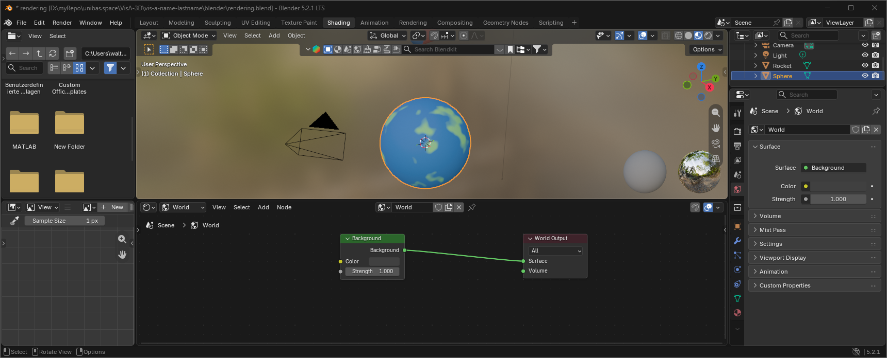

*Switch the Shader Editor from Object to World to edit the scene background instead of an object material.*

2. Add an **Environment Texture** and open **`assets/sky/space-panorama.png`**. Use Equirectangular projection and sRGB.
3. Connect **Environment Texture Color → Background Color**, then **Background → World Output Surface**. Set Background Strength to **0.5**.

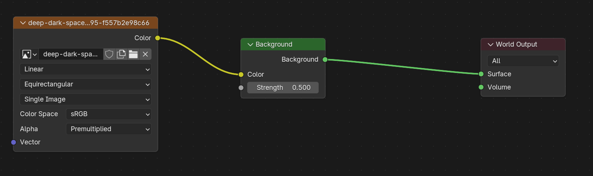

*World node connections. This capture uses another environment image; load the supplied space-panorama.png for the self-contained workshop.*

#### Add the camera and light

1. Add a **Camera** at `(0, -14, 7)`, Rotation `(63.435°, 0°, 0°)`. In Camera Data, choose **Perspective** and a focal length of **50 mm**.
2. Add an **Area Light** at `(0, -5, 7)`, Rotation `(35°, 0°, 0°)`, Power **1500 W**, Size **5**. The dark sky image is mainly a background; this light makes the models readable.
3. Choose **EEVEE** as the render engine. Set output resolution to **1280 × 720**, **100%**.
4. Enter Camera View using **Numpad 0** or **View → Cameras → Active Camera**. Adjust the framing until both assets fit.

> [!TIP]
> **Frame through the viewport:** navigate to a view you like, then press **Ctrl+Alt+Numpad 0** to align the active camera to it. Alternatively, enter Camera View, open **N → View**, and enable **Lock Camera to View**; navigate normally, then disable the lock when finished. With the camera selected, **G, Z, Z** moves it along its own viewing axis.

> [!NOTE]
> **Why use Perspective here?** An orthographic camera uses parallel viewing rays. An environment map can therefore appear uniform because those rays sample the same direction. The perspective camera shows different directions across the frame and makes the star background visible. This is separate from the orthographic gameplay camera used later in Godot.

#### Render and save

1. Disable **Render Properties → Film → Transparent** so the world background appears.
2. If checking the sky in Material Preview, enable **Scene World** in the shading dropdown; otherwise Blender can show its preview environment instead. **Rendered** viewport shading uses the scene settings.
3. Press **F12**. In Render Result, choose **Image → Save As** and save **`renders/showcase.png`**.
4. Make external paths relative and save `showcase.blend`.

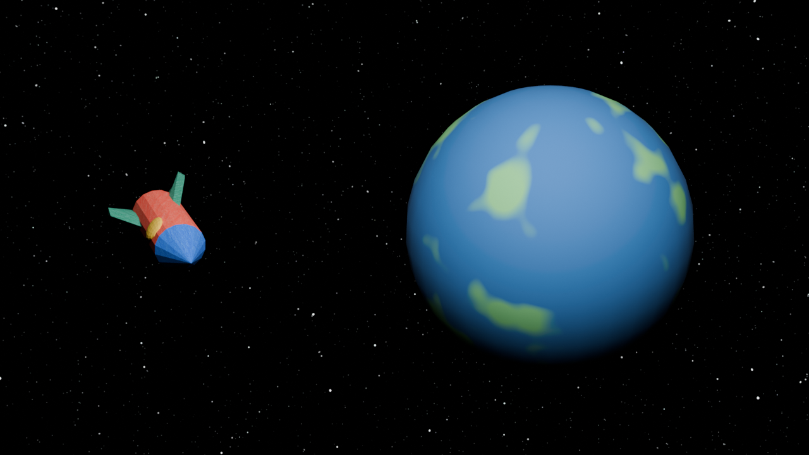

*A completed example composition. Placement, camera framing, and the star pattern may differ from your scene and supplied panorama.*

> [!TIP]
> **Optional Cycles render:** in **Edit → Preferences → System → Cycles Render Devices**, select a supported GPU backend, such as **OptiX** for an NVIDIA RTX card, and enable the GPU. Then choose **Cycles → Device: GPU Compute** in Render Properties. Start with **64 samples and denoising**. EEVEE already renders on the GPU and does not use this Cycles device selector. CPU is sufficient for the small color bake below.

### A6. See why the planet material needs baking

Open your original **`planet.blend`**, leaving its procedural graph connected for the first comparison.

#### First import: geometry without the procedural pattern

1. Select only Planet in Object Mode. Choose **File → Export → glTF 2.0**, format **glTF Binary (`.glb`)**, with **Selected Objects**, materials, UVs, and normals enabled. Keep **+Y Up**.
2. Save **`exports/planet-unbaked.glb`**.
3. Open the **existing VisA Godot project** from setup. Create `res://assets/tests/` and copy this file into it using the file explorer.
4. Wait for import, then double-click the GLB to open the advanced import preview. The sphere geometry is present, but the Blender noise/color-ramp pattern is not reproduced; it may appear as a uniform fallback color.
5. Close the preview and return to Blender. Keep this comparison asset separate from the final `planet.glb`.

> [!IMPORTANT]
> glTF does not transfer an arbitrary Blender shader graph for Godot to execute. A base-color image connected to Principled BSDF is portable. Baking records the procedural color into that image.

#### Bake only the base color

1. Select Planet, switch the render engine to **Cycles**, and use CPU or your configured GPU.
2. Confirm a UV map exists under **Object Data Properties → UV Maps**.

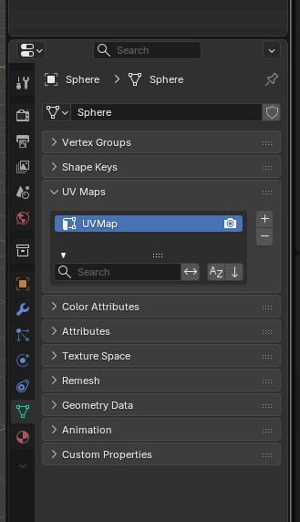

*The UV Sphere already has a UV map. Baking uses this mapping to place surface colors into the destination image.*

3. In the Shader Editor, add an **Image Texture** node. Click **New**, name the image **PlanetBaseColor**, and choose **1024 × 1024**, normal 8-bit color, sRGB.
4. Leave this destination node **unconnected**. Keep Noise → Color Ramp → Principled Base Color connected while baking.
5. Click the new image node to make it **active**, select only Planet, and remain in Object Mode.
6. In **Render Properties → Bake**, choose **Diffuse**. Under Influence / Contributions, enable **Color** and disable **Direct** and **Indirect**. Leave **Selected to Active** off and use a **16 px margin**.


*Bake Diffuse with Color enabled and Direct/Indirect disabled. The screenshot uses CPU; the same bake can use a configured supported GPU.*

7. Click **Bake**. The result should contain the colored pattern without baked scene lighting or shadows.
8. In the Image Editor, select PlanetBaseColor and choose **Image → Save As**. Save **`assets/textures/planet-basecolor.png`** in your Blender folder.

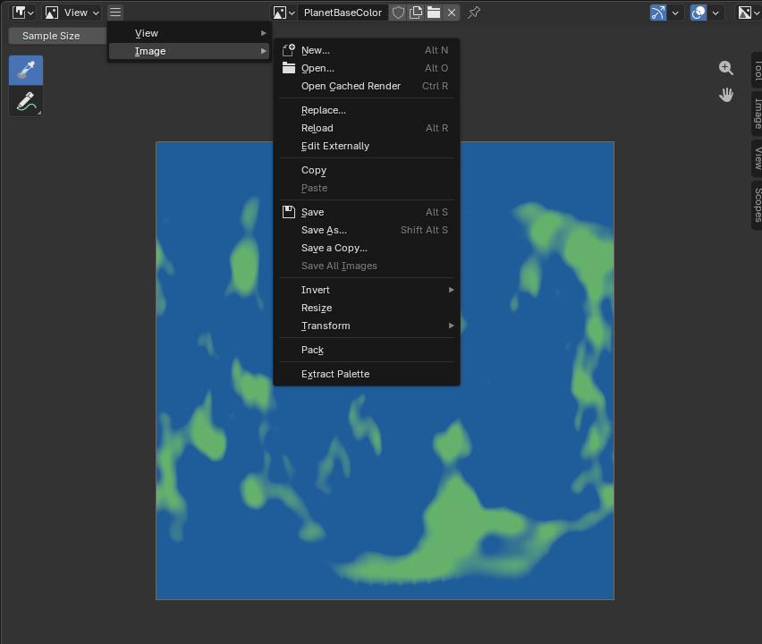

*Save the generated image as assets/textures/planet-basecolor.png before exporting the material.*

9. Now connect **PlanetBaseColor Color → Principled Base Color**, replacing the ramp's final connection. Keep the procedural nodes in the graph for later edits. Roughness remains **0.85**, Metallic **0**.
10. Save `planet.blend`.

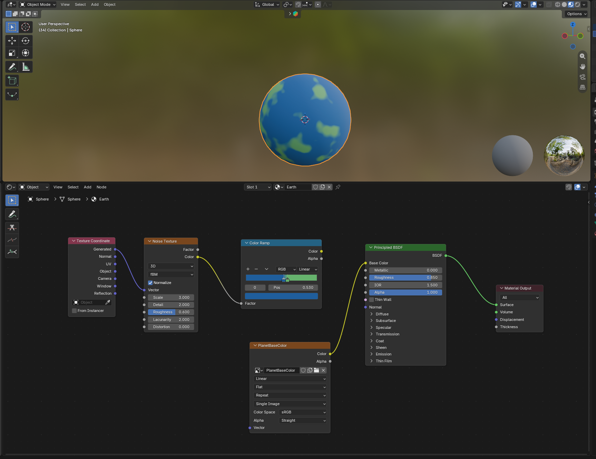

*After baking, the image feeds Base Color. The disconnected procedural branch is retained for future edits and rebaking.*

> [!IMPORTANT]
> Saving the `.blend` does not replace saving the generated image externally. To rebake a changed palette, reconnect the procedural ramp to Base Color first, leave the destination image unconnected but active, bake, save the PNG, then reconnect the image.

The rocket already uses an ordinary image texture. It does not need another color bake.

### A7. Clean up, export, and check the result in Godot

#### Keep the files portable

1. Save all modified Blender files and generated images.
2. In each `.blend`, choose **File → External Data → Make All Paths Relative**. A path such as **`//assets/textures/planet-basecolor.png`** is relative to that `.blend` file's folder; it will still work when the entire named Blender folder is moved to another computer.
3. Use **File → External Data → Report Missing Files** to check for unresolved image dependencies. Keep the copied `assets/` directory beside the `.blend` files.
4. In `rocket.blend`, keep RocketSource hidden in the viewport and render, and select only the joined Rocket object. Leave the editable source collection intact.

> [!TIP]
> **Pack Resources** can embed supported external resources into a `.blend` for a self-contained checkpoint. The workshop uses explicit relative image files so you can see and commit the dependencies. Moving only the `.blend` without its assets can break those paths.

#### Export the final models

For Planet in `planet.blend` and Rocket in `rocket.blend`:

1. Select only the final asset mesh in Object Mode. Check origin zero, rotation zero, unit scale, UVs, and the image-based material.
2. Choose **File → Export → glTF 2.0**.


*Choose the glTF 2.0 exporter, then select GLB and export only the intended mesh.*

3. Choose **glTF Binary (`.glb`)** and enable **Selected Objects**. Export materials, UVs, and normals. Keep the default **+Y Up** conversion. Use the normal embedded-image GLB export, not a separate-texture option.
4. Save **`exports/planet.glb`** and **`exports/rocket.glb`**.
5. Copy the final files into **`Name-Lastname-godot/assets/models/`**, creating the folder if necessary. Copy the sky into **`Name-Lastname-godot/assets/sky/space-panorama.png`**.
6. Return to Godot and open each GLB's import preview. Check both geometry and texture. Compare the final planet with `planet-unbaked.glb` from A6.

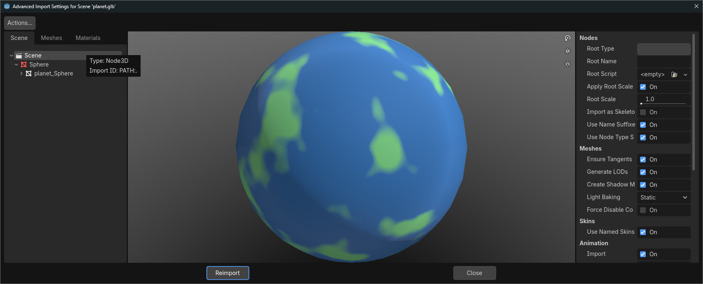

*Final planet import: the baked pattern is present. Compare this with the earlier unbaked export, which cannot reproduce the Blender procedural graph.*

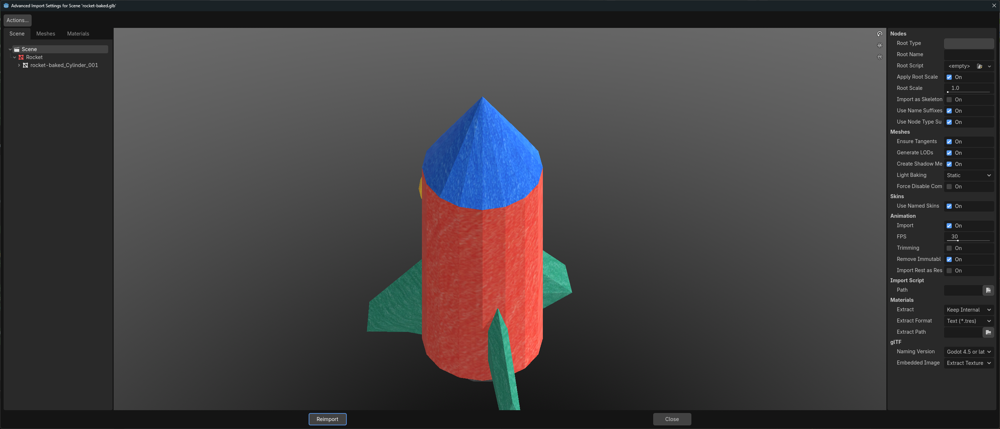

*Check the rocket color and geometry in the import preview. The model stands along +Y here; its gameplay orientation is adjusted in the wrapper scene.*

> [!NOTE]
> Blender uses Z-up; glTF and Godot use Y-up. The exported rocket therefore arrives pointing along +Y. We will rotate its **visual child** in Godot to face -Z. Do not add another manual rotation during export.

**Task 1.A complete:** You have three Blender files, a rendered PNG, and two final GLBs. The final GLBs are already imported into your Godot project.

#### Troubleshooting Task 1.A

| Symptom | Check |
| --- | --- |
| Pink material | Missing image; reopen it from the local assets folder and make paths relative |
| Every atlas color appears on one part | Shrink its UVs and move all islands inside one patch |
| Fin copies move away or change size | Fin/Empty share the origin; scale is one; Relative/Constant Offset are off |
| Duplicate rocket surfaces or unexpected shadows | Hide RocketSource in both viewport and render; keep only RocketExport visible |
| Plain sky in the Blender render | Use Perspective; check Film Transparent is off and the World nodes are connected |
| Preview sky differs from render | Enable Scene World in Material Preview, or use Rendered shading |
| Black bake or no destination | Cycles; Planet selected; active destination image; procedural source still connected |
| Bake contains shadows | Diffuse contributions must include Color only |
| Final planet loses its pattern in Godot | Saved image must feed Principled Base Color before final export |
| GLB contains extra parts | Export from the individual source file with only the final mesh selected |

---

## Task 1.B — Prepare the physical scenes in Godot

**Time target: approximately 25 minutes.** Continue in the **VisA-Name-Lastname** project created during setup. The final GLBs and sky were copied into it at the end of Task 1.A.

### B1. Set up the game area

#### Create Main and check the imported files

1. Create a **3D Scene**, rename its `Node3D` root to **Main**, and save it as **`res://scenes/main/Main.tscn`**. Leave the root transform at identity.
2. Confirm the files in the FileSystem panel:

| Godot path | Content |
| --- | --- |
| `res://assets/models/planet.glb` | Final planet with baked base color |
| `res://assets/models/rocket.glb` | Joined rocket export |
| `res://assets/sky/space-panorama.png` | Background panorama |
| `res://assets/tests/planet-unbaked.glb` | Optional comparison from A6 |


*Godot imports files copied inside its project. This earlier capture uses other folders and filenames; follow assets/models and assets/sky in the table.*

3. In **Project → Project Settings → Display → Window**, set **Viewport Width 1280** and **Viewport Height 720**. Under Stretch, use **Mode: canvas_items** so the HUD scales with the viewport. The settings search can locate each property.


*Set the viewport to 1280 by 720. Use the settings search to locate the width, height, and stretch mode.*

4. Keep **Physics → Common → Physics Ticks per Second = 60**.
5. Add these direct children to Main:

| Node | Type | Settings |
| --- | --- | --- |
| `Camera3D` | Camera3D | Position `(0, 20, 0)`; Rotation `(-90°, 0°, 0°)`; Projection **Orthogonal**; Keep Aspect **Keep Height**; Size **24**; Current on |
| `Sun` | DirectionalLight3D | Rotation `(-45°, -30°, 0°)`; Energy **1.5** |
| `WorldEnvironment` | WorldEnvironment | Configure below |
| `HUD` | CanvasLayer | Default settings |

The orbit lies in the **XZ plane**, at Y = 0. The camera looks down on that plane; world -Z points upward on screen. No ground plane is needed.

#### Add a readable status label

1. Select HUD and add a **Label** child named **Status**. It belongs to the screen overlay, not the 3D scene geometry.
2. Switch to the **2D** workspace and select Status. Under **Layout**, choose an anchor layout and the **Top Left** preset, so all four anchors are zero. Keep this Label directly under CanvasLayer; do not add a Container parent.
3. Expand **Layout → Transform**. Set Position **`(16, 16)`** and Size **`(1224, 114)`**.
4. If your Inspector exposes offsets instead, enter **Left 16, Top 16, Right 1240, Bottom 130**. These are edge positions relative to the same top-left anchor: width = 1240 − 16 and height = 130 − 16. Use either representation; they describe the same rectangle.
5. Set Text to **`Orbit workshop`**, leave the text aligned left/top, and set **Theme Overrides → Font Sizes → Font Size = 18**.

> [!NOTE]
> Anchors define the reference point; position/offsets place the rectangle relative to it. The status is a 2D overlay and remains at the upper-left while the 3D camera changes. See [Godot's explanation of anchors and offsets](https://docs.godotengine.org/en/stable/tutorials/ui/size_and_anchors.html).


*Main contains the 3D camera and environment plus a CanvasLayer HUD with the Status label. Use HUD as the node name even if the capture shows Hud.*

#### Add the sky and ambient light

1. Select WorldEnvironment and create a new **Environment** resource.
2. Set **Background → Mode = Sky**. Under Sky, create a **Sky** resource, then a **PanoramaSkyMaterial** as its Sky Material.
3. Assign **`res://assets/sky/space-panorama.png`** to **Panorama**.

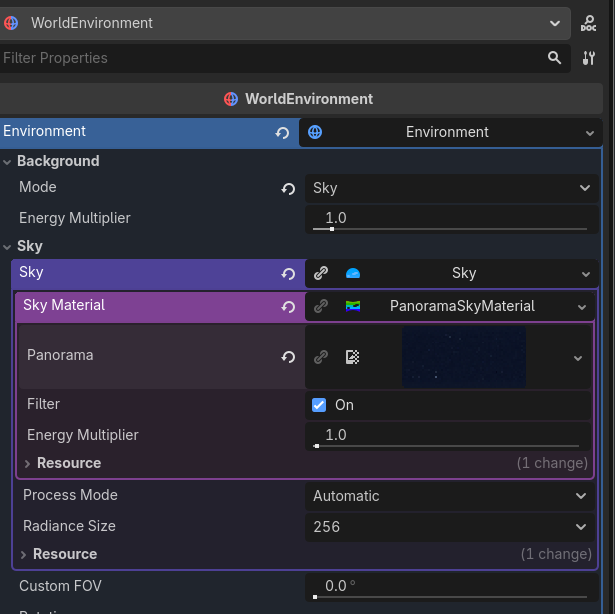

*Environment contains a Sky resource, whose material reads the panorama image.*

4. Set **Ambient Light → Source = Color**, Color **`#B8CCE6`** (pale blue-gray), and Energy **0.5**. Use full opacity; append `FF` if the color field requires RGBA.


*Use Color as the ambient source, the specified pale blue-gray, and energy 0.5.*

5. Save and run the current Main scene with **F6**. At this stage, expect the star background and label, without the planet or rocket.


*Expected result before instancing the models: a sky background and a readable status label in the upper-left.*

Godot's [PanoramaSkyMaterial](https://docs.godotengine.org/en/stable/classes/class_panoramaskymaterial.html) displays the 2:1 environment image. The background is separate from the ambient and directional lighting that make the models visible.

### B2. Create the planet scene

1. Create a new scene using **Other Node → StaticBody3D** and name the root **Planet**.
2. Drag `planet.glb` from the FileSystem panel onto Planet. Rename this imported instance **PlanetVisual**. Keep its position/rotation zero and scale one.
3. Add **CollisionShape3D** directly under Planet. In its Shape field, create **SphereShape3D** and set Radius **2.0**. Keep the node transform at identity.

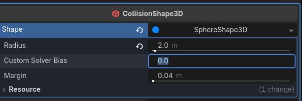

*Set the SphereShape3D resource radius to 2.0 instead of scaling the collision node.*


*PlanetVisual and CollisionShape3D are siblings under the physical Planet root.*

4. Select Planet. Under Collision, enable **Layer 1 only** and **Mask 2 only**. Disable any other checked boxes.


*Only layer 1 and mask 2 are enabled for the planet.*

5. Save as **`res://scenes/planet/Planet.tscn`**.

| Node path | Responsibility |
| --- | --- |
| `Planet` | Fixed physical body |
| `Planet/PlanetVisual` | Imported visual model |
| `Planet/CollisionShape3D` | Sphere of radius 2 |

> [!IMPORTANT]
> The visible mesh and collision geometry are separate. Change the sphere's **Radius**, not the physical body's Scale. Keep Planet and CollisionShape3D at unit scale. A collision layer identifies the body; its mask selects layers to interact with.

### B3. Create the rocket scene

1. Create a new scene with a **CharacterBody3D** root named **Rocket**.
2. Add a **Node3D** child named **Visual**. Drag `rocket.glb` below Visual, keeping the imported instance's own transform unchanged.
3. Set **Visual Scale `(0.5, 0.5, 0.5)`** and **Rotation `(-90°, 0°, 0°)`**. The rocket's nose should now point along its parent's **-Z**, the forward direction used by our code.
4. Add **CollisionShape3D directly under Rocket**, beside Visual. Give it a **SphereShape3D**, Radius **0.65**, centered at zero. Keep the body and collider scales at one.
5. Select Rocket and set **Collision Layer 2 only**, **Collision Mask 1 only**.

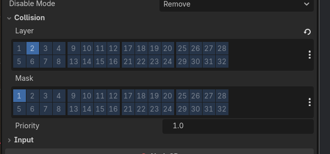

*Only layer 2 and mask 1 are enabled for the rocket, matching the planet setup.*

6. Set Rocket's **Motion Mode to Floating**. We will move it with `MoveAndCollide`, without floor movement logic.

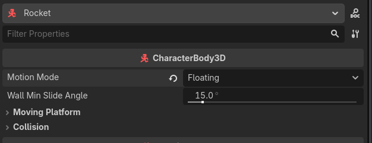

*Use Floating for the rocket. The script will provide movement and gravity.*

7. Save as **`res://scenes/rocket/Rocket.tscn`**. Check that the collider encloses the model.

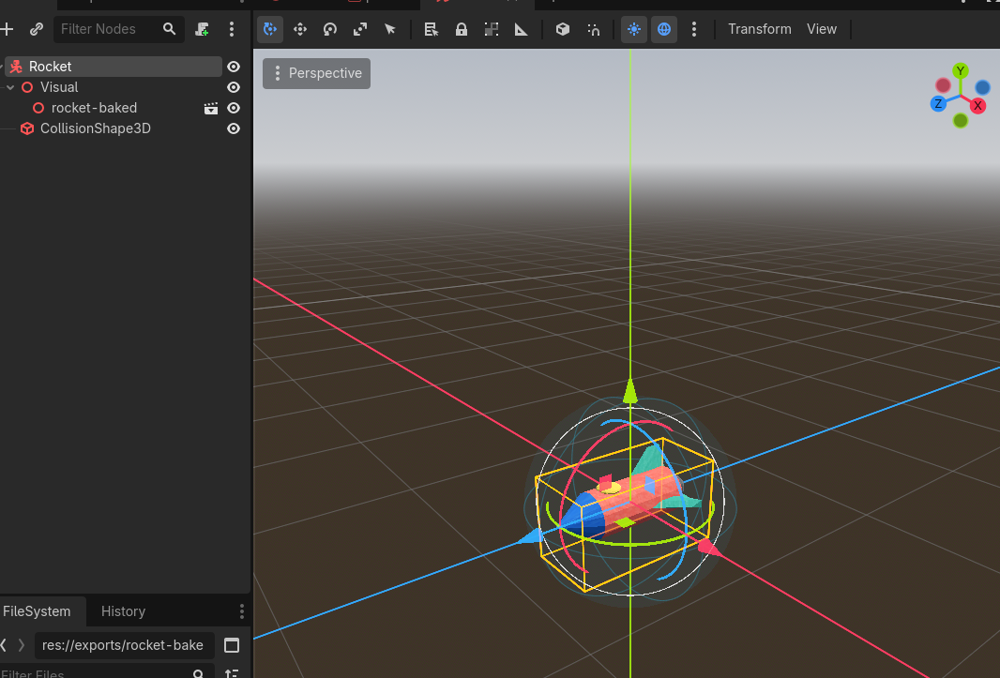

*Inspect the artwork inside the bounding sphere. Scale and orientation changes belong on Visual; the collider stays beside it on the unscaled body.*

| Node path | Responsibility |
| --- | --- |
| `Rocket` | Script-controlled physical body |
| `Rocket/Visual` | Scale and axis correction for the artwork |
| `Rocket/Visual/rocket` | Imported instance; its name may differ |
| `Rocket/CollisionShape3D` | Conservative bounding sphere |

> [!NOTE]
> The sphere intentionally approximates the whole rocket, including its fins. Contact can occur before the visible hull touches the planet. Keep styling inside this sphere for the reference experiment. A closer capsule or convex collider is a later refinement.

We use **CharacterBody3D** because the script computes motion. It provides collision-aware movement without requiring the rigid-body force solver. Creating it does not automatically supply our central gravitational attraction.

### B4. Place both scenes in Main

1. Reopen Main.tscn. Drag **Planet.tscn** into Main and set Position `(0, 0, 0)`, Rotation zero, Scale one.
2. Drag **Rocket.tscn** into Main and set Position `(6, 0, 0)`, Rotation zero, Scale one.


*Both reusable scenes are instanced in Main: planet at the origin, rocket initially at X = 6.*

3. Save and press **F5**. Choose **Main.tscn** as the main scene when prompted. If SetupCheck was previously assigned, set **Project Settings → Application → Run → Main Scene** to Main.tscn.
4. Confirm both assets are visible. The rocket is stationary until the script is added.


*The stationary game scene before adding the orbit logic. The normal view shows visual meshes without collision overlays.*

> [!TIP]
> Use **Debug → Visible Collision Shapes** while running to inspect the physical approximations. The normal game screenshot above shows the visual meshes; it is not a collision-overlay screenshot. If models seem too small, verify their scale and the camera's Orthogonal Size before changing any physical dimensions.

### B5. Configure the input actions

Open **Project → Project Settings → Input Map**. Add each action with exactly the spelling below, then assign its keyboard event using the **Physical Key** option when available.

| Action | Key | Before launch | During flight |
| --- | --- | --- | --- |
| `place_left` | Left arrow | Move along -X | — |
| `place_right` | Right arrow | Move along +X | — |
| `place_forward` | Up arrow | Move along -Z | — |
| `place_back` | Down arrow | Move along +Z | — |
| `turn_left` | A | Aim left | Turn left |
| `turn_right` | D | Aim right | Turn right |
| `speed_down` | Z | Decrease initial speed | — |
| `speed_up` | X | Increase initial speed | — |
| `launch` | Space | Launch | — |
| `thrust` | W | — | Accelerate in the nose direction |
| `pause` | P | — | Pause/resume |
| `reset` | R | Restore defaults | Restore defaults |

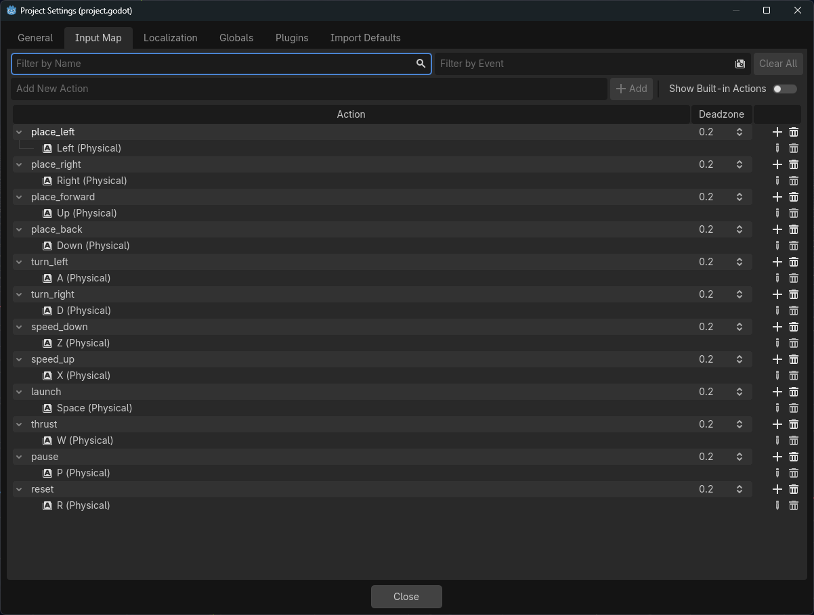

*Enter the action names exactly as listed. The code refers to these names rather than directly to keyboard keys.*

The reference initial position is `(6, 0, 0)`, and velocity is `(0, 0, -4)`. The script restricts placement to radii 3–9 to keep the rocket outside the planet; the demonstration area ends at radius 10.

**Task 1.B complete:** The two scene instances have visual models, collision shapes, and input actions ready for the simulation.

#### Troubleshooting Task 1.B

| Symptom | Check |
| --- | --- |
| SetupCheck runs instead of Main | Change Application → Run → Main Scene, or use F6 on Main |
| Nothing visible | Active camera, X rotation -90°, both model positions, and lighting |
| Status is missing or misplaced | Label directly under CanvasLayer; top-left anchors; position `(16, 16)`; size `(1224, 114)` |
| Rocket points upward | Rotate Visual by -90° around X; do not rotate only the camera |
| Collider is too large or too small | Planet radius 2; rocket visual scale 0.5; rocket collider radius 0.65; physical roots unscaled |
| Imported content seems read-only | Edit the wrapper scene; keep the imported GLB as its visual child |
| Model edits do not appear | Re-export the final mesh, replace the GLB in `res://assets/models/`, and allow reimport |

---

## Task 1.C — Add control logic and simulate the orbit


**Time target: 30 minutes.** Prerequisites: the Main, Planet, and Rocket scenes from Task 1.B, working input actions, and a tested C# setup.

### C1. Add the complete script

**Project:** `Name-Lastname-godot/` · **File:** `Name-Lastname-godot/scenes/rocket/RocketOrbit.cs` · **Namespace:** `VisA.OrbitWorkshop` · **Class:** `RocketOrbit`.

1. Open Rocket.tscn and attach a **C#** script named `RocketOrbit.cs` to its CharacterBody3D root. Continue using the C# project created during setup.
2. Replace the generated file with the complete code below, or copy `code/RocketOrbit.cs` into that location. Keep only one compiled copy of this class inside the Godot project.
3. Build the project in Godot. Confirm there are no errors.

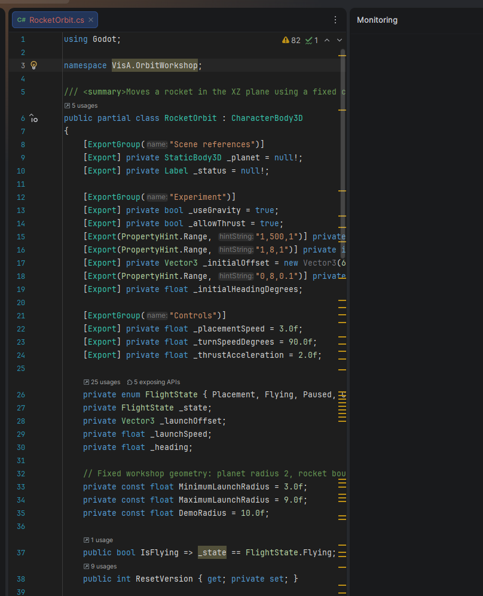

*Attach RocketOrbit.cs to the CharacterBody3D root and build the project after copying the complete script.*


4. Open **Main.tscn**, select the **Rocket instance**, and assign its exported **Planet** field by dragging Main's Planet node into it. Assign **Status** by dragging `Main/HUD/Status` into that field. These references belong on the instance in Main because the standalone Rocket scene cannot reference Main's nodes.


*Assign Planet and Status on the Rocket instance in Main. These fields become available after a successful C# build.*

5. Keep Initial Offset `(6, 0, 0)`, Initial Speed **4**, Initial Heading Degrees **0**, Mu **96**, and Substeps **4**.

6. For the first experiment, turn **Use Gravity off** and **Allow Thrust off**. Save Main.tscn and run the main project with **F5**.


*Disable both options for the first straight-line experiment; keep Mu 96 and Substeps 4.*

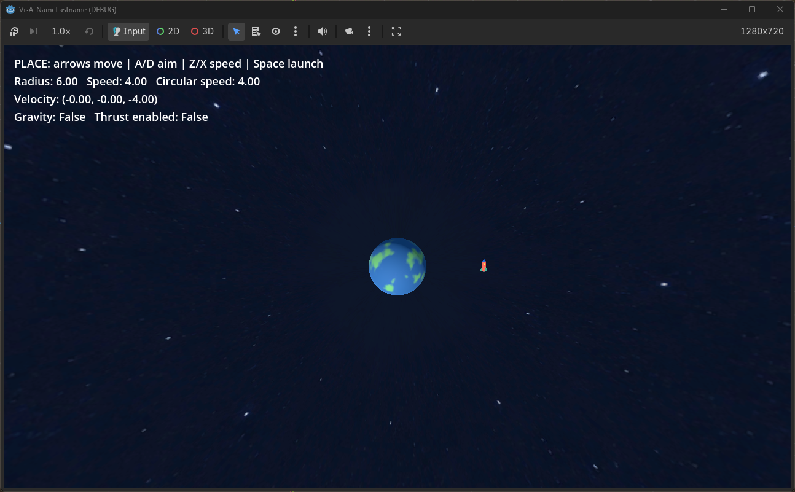

*Before launch, the HUD shows the reference radius 6, speed 4, and velocity (0, 0, -4). Space starts this configured experiment.*


```csharp
using Godot;

namespace VisA.OrbitWorkshop;

/// <summary>Moves a rocket in the XZ plane using a fixed central gravitational field.</summary>
public partial class RocketOrbit : CharacterBody3D
{
    [ExportGroup("Scene references")]
    [Export] private StaticBody3D _planet = null!;
    [Export] private Label _status = null!;

    [ExportGroup("Experiment")]
    [Export] private bool _useGravity = true;
    [Export] private bool _allowThrust = true;
    [Export(PropertyHint.Range, "1,500,1")] private float _mu = 96.0f;
    [Export(PropertyHint.Range, "1,8,1")] private int _substeps = 4;
    [Export] private Vector3 _initialOffset = new Vector3(6.0f, 0.0f, 0.0f);
    [Export(PropertyHint.Range, "0,8,0.1")] private float _initialSpeed = 4.0f;
    [Export] private float _initialHeadingDegrees;

    [ExportGroup("Controls")]
    [Export] private float _placementSpeed = 3.0f;
    [Export] private float _turnSpeedDegrees = 90.0f;
    [Export] private float _thrustAcceleration = 2.0f;

    private enum FlightState { Placement, Flying, Paused, Crashed, OutsideArea }
    private FlightState _state;
    private Vector3 _launchOffset;
    private float _launchSpeed;
    private float _heading;

    // Fixed workshop geometry: planet radius 2, rocket bounding radius 0.65.
    private const float MinimumLaunchRadius = 3.0f;
    private const float MaximumLaunchRadius = 9.0f;
    private const float DemoRadius = 10.0f;

    public bool IsFlying => _state == FlightState.Flying;
    public int ResetVersion { get; private set; }

    public override void _Ready()
    {
        if (_planet == null || _status == null)
        {
            GD.PushError("Assign Planet and Status on the Rocket instance in Main.tscn.");
            SetPhysicsProcess(false);
            return;
        }

        ResetExperiment();
    }

    public override void _PhysicsProcess(double delta)
    {
        float dt = (float)delta;

        if (Input.IsActionJustPressed("reset"))
        {
            ResetExperiment();
            return;
        }

        if (Input.IsActionJustPressed("pause"))
        {
            if (_state == FlightState.Flying)
            {
                _state = FlightState.Paused;
            }
            else if (_state == FlightState.Paused)
            {
                _state = FlightState.Flying;
            }
        }

        if (_state == FlightState.Placement)
        {
            UpdatePlacement(dt);
        }
        else if (_state == FlightState.Flying)
        {
            Simulate(dt);
        }

        UpdateStatus();
    }

    private void ResetExperiment()
    {
        _state = FlightState.Placement;
        _launchOffset = ClampLaunchOffset(_initialOffset);
        _launchSpeed = Mathf.Clamp(_initialSpeed, 0.0f, 8.0f);
        _heading = Mathf.DegToRad(_initialHeadingDegrees);
        GlobalPosition = _planet.GlobalPosition + _launchOffset;
        Rotation = new Vector3(0.0f, _heading, 0.0f);
        Velocity = Vector3.Zero;
        ResetVersion++;
        UpdateStatus();
    }

    private static Vector3 ClampLaunchOffset(Vector3 offset)
    {
        offset.Y = 0.0f;
        float radius = offset.Length();
        if (radius < 0.001f) return Vector3.Right * MinimumLaunchRadius;
        return offset / radius * Mathf.Clamp(radius, MinimumLaunchRadius, MaximumLaunchRadius);
    }

    private void UpdatePlacement(float dt)
    {
        Vector2 input = Input.GetVector("place_left", "place_right", "place_forward", "place_back");
        Vector3 movement = new Vector3(input.X, 0.0f, input.Y) * _placementSpeed * dt;
        _launchOffset = ClampLaunchOffset(_launchOffset + movement);
        GlobalPosition = _planet.GlobalPosition + _launchOffset;

        _heading += Input.GetAxis("turn_right", "turn_left") * Mathf.DegToRad(_turnSpeedDegrees) * dt;
        _launchSpeed = Mathf.Clamp(_launchSpeed + Input.GetAxis("speed_down", "speed_up") * 2.0f * dt, 0.0f, 8.0f);
        Rotation = new Vector3(0.0f, _heading, 0.0f);

        if (Input.IsActionJustPressed("launch"))
        {
            Velocity = -GlobalBasis.Z * _launchSpeed;
            _state = FlightState.Flying;
        }
    }

    private void Simulate(float dt)
    {
        if (_allowThrust)
        {
            _heading += Input.GetAxis("turn_right", "turn_left") * Mathf.DegToRad(_turnSpeedDegrees) * dt;
            Rotation = new Vector3(0.0f, _heading, 0.0f);
        }

        int steps = Mathf.Max(_substeps, 1);
        float h = dt / steps;
        for (int i = 0; i < steps; i++)
        {
            Vector3 acceleration = Vector3.Zero;
            if (_useGravity)
            {
                Vector3 toPlanet = _planet.GlobalPosition - GlobalPosition;
                toPlanet.Y = 0.0f;
                float distanceSquared = Mathf.Max(toPlanet.LengthSquared(), 0.01f);
                acceleration = toPlanet.Normalized() * (_mu / distanceSquared);
            }

            if (_allowThrust && Input.IsActionPressed("thrust"))
            {
                acceleration += -GlobalBasis.Z * _thrustAcceleration;
            }

            // Semi-implicit Euler: update velocity, then sweep the proposed displacement.
            Velocity += acceleration * h;
            KinematicCollision3D? collision = MoveAndCollide(Velocity * h);
            if (collision != null)
            {
                Velocity = Vector3.Zero;
                _state = FlightState.Crashed;
                GD.Print("Collision: experiment finished. Press R to reset.");
                break;
            }

            if (GlobalPosition.DistanceTo(_planet.GlobalPosition) > DemoRadius)
            {
                _state = FlightState.OutsideArea;
                break;
            }
        }
    }

    private void UpdateStatus()
    {
        Vector3 displayedVelocity = _state == FlightState.Placement ? -GlobalBasis.Z * _launchSpeed : Velocity;
        float radius = GlobalPosition.DistanceTo(_planet.GlobalPosition);
        float circularSpeed = Mathf.Sqrt(_mu / Mathf.Max(radius, 0.001f));
        string stateText = _state switch
        {
            FlightState.Placement => "PLACE: arrows move | A/D aim | Z/X speed | Space launch",
            FlightState.Flying => "FLYING: A/D turn | W thrust | P pause | R reset",
            FlightState.Paused => "PAUSED: P resume | R reset",
            FlightState.Crashed => "COLLISION: R reset",
            _ => "OUTSIDE DEMO AREA: R reset (this alone does not prove escape)"
        };

        _status.Text = stateText + $"\nRadius: {radius:F2}   Speed: {displayedVelocity.Length():F2}   Circular speed: {circularSpeed:F2}";
        _status.Text += $"\nVelocity: ({displayedVelocity.X:F2}, {displayedVelocity.Y:F2}, {displayedVelocity.Z:F2})";
        _status.Text += $"\nGravity: {_useGravity}   Thrust enabled: {_allowThrust}";
    }
}
```

Main and the physical roots start at unit scale and zero rotation as described in Task 1.B; the script then owns the rocket heading. The visual child's fixed orientation correction is separate from the rocket's heading.

### C2. Observe motion without gravity

1. Use the arrow keys to move the rocket, A/D to aim, and Z/X to change initial speed. Its nose defines the launch direction; the HUD shows the resulting velocity vector.
2. Press R to restore the reference case, then Space to launch.
3. With gravity and thrust disabled, the rocket moves in a straight line at constant velocity.
4. Press P to pause/resume. Press R to reset. The simulation also stops at the edge of the finite demonstration area, radius 10.

The relevant operation in `Simulate` is:

```csharp
KinematicCollision3D? collision = MoveAndCollide(Velocity * h);
```

Velocity is distance per unit time; `Velocity * h` is displacement. `MoveAndCollide` takes displacement, not velocity. Godot checks the swept motion of the collision shape and reports contact. See [PhysicsBody3D's movement API](https://docs.godotengine.org/en/stable/classes/class_physicsbody3d.html).

### C3. Add central gravity

Stop the game, select Rocket in Main, enable **Use Gravity**, leave **Allow Thrust off**, save, and run again. Press Space without changing the defaults.


*Enable gravity while keeping thrust disabled to isolate the orbit behavior.*


Let **r** point from the rocket to the planet. The acceleration is

$$
\mathbf{a} = \mu\frac{\mathbf{r}}{\lVert\mathbf{r}\rVert^3}, \qquad \mu = GM.
$$

In the code, this is a unit direction multiplied by `mu / distanceSquared`. The rocket is treated as a test body: the planet stays fixed, and rocket mass cancels from its gravitational acceleration. We use consistent demonstration units rather than real astronomical scales.

The integrator is **semi-implicit Euler**:

$$
\mathbf{v}_{n+1} = \mathbf{v}_n + \mathbf{a}(\mathbf{x}_n)h, \qquad
\mathbf{x}_{n+1} = \mathbf{x}_n + \mathbf{v}_{n+1}h.
$$

The position step is performed by the collision sweep. The two key statements are:

```csharp
Velocity += acceleration * h;
KinematicCollision3D? collision = MoveAndCollide(Velocity * h);
```

The order matters: position uses the updated velocity. Godot calls `_PhysicsProcess` at a fixed physics rate. Four substeps within each 1/60-second tick give approximately `h = 1/240 s`. Rendering frame rate is not the integration rate.

For a circular orbit, tangential speed is

$$
v_c = \sqrt{\frac{\mu}{r}}.
$$

At radius 6 with μ = 96, this gives **4**. The initial velocity `(0, 0, -4)` is perpendicular to the initial radius `(6, 0, 0)`. The ideal period is approximately **9.42 seconds**.

**Expected result:** A near-circular numerical trajectory around the planet. Small radial oscillations are expected; this is an approximation, not an exact analytic orbit. Compare one and four substeps only after the reference case works.


*A flight snapshot near radius 6 and speed 4. Thrust is enabled in this capture, but enabling it alone applies no thrust; leave it off for the reference experiment.*

### C4. Add rocket control

Stop the game, enable **Allow Thrust** on Rocket in Main, save, and run again.

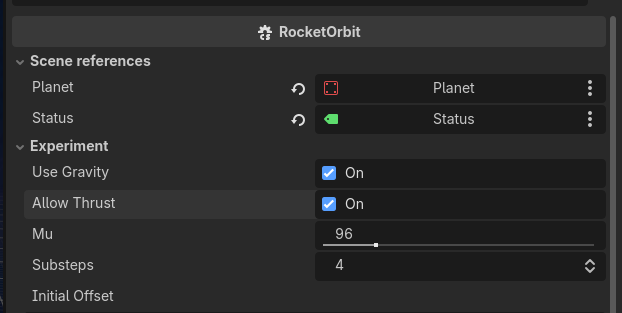

*Enable Allow Thrust to permit steering and acceleration. Acceleration is applied only while W is held.*


- A/D turns the nose. Changing orientation alone does not change the existing velocity.
- W adds acceleration along the nose direction.
- P pauses without resetting the state.
- R restores the original Inspector-defined position, heading, and speed.

This simple model treats steering as directly controlled orientation and thrust as constant acceleration. It has no fuel, drag, spin dynamics, or varying mass. The rocket can continue moving sideways relative to its nose, as expected when orientation and velocity differ.

### C5. Finish on collision

1. Reset with R.
2. Hold Z until initial speed is zero, then press Space.
3. Gravity pulls the rocket inward. The `MoveAndCollide` result becomes non-null when its bounding sphere touches the planet collider.
4. The script stops integration, sets velocity to zero, and displays **COLLISION**. Press R to try again.

The physical contact distance is approximately **2.65** from the planet center: planet radius 2 plus rocket radius 0.65, with a small engine collision margin. We do not implement a bounce or a separate geometric hit test.


*The run has stopped at a center distance of about 2.65, matching the two bounding radii. This capture does not display collision overlays.*

### C6. Compare three or four experiments

Use the Inspector for exact speeds: stop the game, select Rocket in Main, change Initial Speed, save, and run. Keep Initial Offset `(6, 0, 0)`, Heading 0, gravity on, and thrust off.

| Initial speed | Expected behavior | Explanation |
| --- | --- | --- |
| 0 | Falls into the planet and stops | No initial tangential motion |
| 3.5 | Elliptical orbit, initially moving inward | Below circular speed but enough clearance for these colliders |
| 4 | Near-circular orbit | Tangential circular speed for μ = 96 and r = 6 |
| 6 | Outward trajectory, eventually outside the demo area | Above the ideal escape speed, approximately 5.66 |

The HUD's **OUTSIDE DEMO AREA** is a display/simulation boundary condition. Leaving radius 10 does not by itself prove escape: a large bound ellipse could also cross it. The interpretation above uses the ideal model and the specific initial conditions.

Discuss: What changes when you rotate the rocket without thrust? Why is a tangential initial velocity necessary for the circular case? What changes when you decrease the step size?

### Optional: show the trajectory

Skip this if time is short. The model already moves visibly without a trail.

**File:** `Name-Lastname-godot/scenes/main/OrbitTrail.cs` · **Namespace:** `VisA.OrbitWorkshop` · **Class:** `OrbitTrail`.

1. Add a **MeshInstance3D** named **Trail** directly under Main. Leave its transform at identity and its Mesh empty.
2. Attach `OrbitTrail.cs`, paste the code below, and build.
3. Select Trail in Main and assign the Rocket instance to its **Rocket** field. Save.
4. The script draws recent positions, retains the trail while paused or after a crash, and clears it on R. It does not predict future motion.

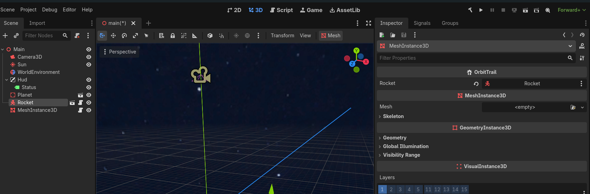

*Attach OrbitTrail to a MeshInstance3D under Main, name that node Trail, and assign its Rocket field. The Mesh is created at runtime.*


```csharp
using Godot;
using System.Collections.Generic;

namespace VisA.OrbitWorkshop;

/// <summary>Displays recent sampled rocket positions; optional visual aid.</summary>
public partial class OrbitTrail : MeshInstance3D
{
    [Export] private RocketOrbit _rocket = null!;
    private readonly List<Vector3> _points = new List<Vector3>();
    private readonly ImmediateMesh _mesh = new ImmediateMesh();
    private int _resetVersion = -1;

    public override void _Ready()
    {
        Mesh = _mesh;
        MaterialOverride = new StandardMaterial3D
        {
            ShadingMode = BaseMaterial3D.ShadingModeEnum.Unshaded,
            AlbedoColor = new Color(0.4f, 0.85f, 1.0f)
        };
        CastShadow = GeometryInstance3D.ShadowCastingSetting.Off;
    }

    public override void _PhysicsProcess(double delta)
    {
        if (_rocket == null) return;
        if (_resetVersion != _rocket.ResetVersion)
        {
            _points.Clear();
            _mesh.ClearSurfaces();
            _resetVersion = _rocket.ResetVersion;
        }

        if (!_rocket.IsFlying) return;
        Vector3 point = ToLocal(_rocket.GlobalPosition);
        if (_points.Count > 0 && _points[_points.Count - 1].DistanceSquaredTo(point) < 0.0025f) return;
        _points.Add(point);
        if (_points.Count > 720)
        {
            _points.RemoveAt(0);
        }

        _mesh.ClearSurfaces();
        if (_points.Count < 2) return;
        _mesh.SurfaceBegin(Godot.Mesh.PrimitiveType.Lines);
        for (int i = 1; i < _points.Count; i++)
        {
            _mesh.SurfaceAddVertex(_points[i - 1]);
            _mesh.SurfaceAddVertex(_points[i]);
        }
        _mesh.SurfaceEnd();
    }
}
```


*The trail records visited positions so you can compare trajectories. It shows recent history, not a prediction of the next orbit.*

### Troubleshooting Task 1.C

| Symptom | Check |
| --- | --- |
| Exported fields missing | Build C# successfully, then select the Rocket instance again |
| Script reports missing references | Assign Planet and Status on Rocket **in Main.tscn**; run Main with F5 |
| No input | Action names must match exactly; focus the game window |
| Immediate collision | Root transforms must be correct; launch outside radius 2.65; colliders must not be under scaled Visual |
| No collision | Planet layer 1; Rocket mask 1; shapes present, direct children of their bodies, and enabled |
| Rocket follows a strange path | Reset to μ = 96, offset `(6, 0, 0)`, speed 4, heading 0, thrust off |
| Rocket nose does not follow the path | Orientation and velocity are separate; turning alone does not change velocity |
| Project uses a rigid-body solver as well | Root must be CharacterBody3D; do not add another movement script or use MoveAndSlide |

**Task 1.C complete:** You can place and launch the rocket, change its trajectory with thrust, observe a near-circular orbit, pause, reset, and terminate the run on collision.

---

## Save and push your work

Save the Blender files, generated images, exported models, and Godot scenes before committing. Your student repository should contain both of your named folders, including every referenced asset.

1. In **`Name-Lastname-godot/.gitignore`**, include the following generated-data exclusions. If the file already exists, add any missing patterns rather than replacing unrelated rules:

```gitignore
.godot/
**/bin/
**/obj/
.idea/
```

2. You may exclude Blender backup versions by placing `*.blend1` and `*.blend2` in **`Name-Lastname-blender/.gitignore`**. Keep the actual `.blend` files, images, and GLBs.
3. Keep Godot's `project.godot`, `.tscn` scenes, `.cs` scripts, C# project/solution, and relevant `.uid` files in Git. The `.godot/` import/build cache is regenerated locally.
4. In a terminal at the **student repository root**, check that you are on the branch assigned in class. Stage only your own folders. Replace `Name-Lastname` in the command with your actual folder prefix:

```bash
git status
git branch --show-current
git add -- Name-Lastname-blender Name-Lastname-godot
git diff --cached --stat
git commit -m "Add my Blender models and Godot orbit workshop"
git pull --rebase
git push
```

> [!IMPORTANT]
> Push to the **student repository**, using the branch announced in class. Check the staged file list before committing; it should contain your work and dependencies, not other students' changes or generated caches.

The pull step brings in commits that others may have pushed. If it reports a conflict, resolve it with the instructor before continuing; do not force-push over other students' work.

### Final checkpoint

- [ ] `planet.blend`, editable `rocket.blend`, and `showcase.blend` are saved.
- [ ] The final rendered image and both textured GLBs are present.
- [ ] Main opens with a camera, light, sky, planet, rocket, and readable status label.
- [ ] Placement, launch, gravity, pause, thrust, collision, and reset work.
- [ ] You can explain the difference between orientation, velocity, and acceleration.
- [ ] Your named folders are committed and pushed to the student repository.

---

## Assets and material recipes

The teaching materials supply the images below. You copy the entire `assets/` folder into your named Blender folder during setup; the sky and exported models are copied into Godot in A7.

| File in `assets/` | Use |
| --- | --- |
| `textures/rocket-pencil-atlas.png` | Six colored pencil regions for the rocket's Base Color; sRGB |
| `sky/space-panorama.png` | A 2:1 illustrated background for Blender and Godot; sRGB, LDR |
| `material-presets.json` | The four procedural planet palettes used in A2 |
| `textures/planet-basecolor.png` | Your own baked output from A6; created during the workshop |


*Use UV placement to choose a patch. There are no prescribed color assignments or exact UV-center coordinates.*


*The supplied panorama is a background rather than an HDR lighting source. Use the scene lights for the models.*

### Optional material helper

The manual node exercise is the main route. If you need the prepared graph, save the planet in **`Name-Lastname-blender/planet.blend`**, select its mesh, and open **`tools/create_planet_material.py`** from the teaching materials in Blender's Text Editor. Set `PALETTE` to `Ocean`, `Rust`, `Ice`, or `Candy` and run it.

The helper reads **`assets/material-presets.json` beside the saved `.blend` file**, assigns a new material to the selected mesh, and leaves saving and baking to you. It does not create a planet mesh or run the bake automatically.

### Optional BlenderKit sky

The supplied sky is sufficient. For another environment, search BlenderKit for **space HDRI** or **starry sky HDRI** and choose a free equirectangular environment. Download it before class and check its own reuse terms before committing a third-party file to the shared repository.

The supplied atlas and panorama were generated for this workshop. The included screenshots and reference illustrations are the material supplied for this revision; they are teaching images, not additional UV textures.

---

## Optional extension — VOXON

If a prepared device integration is available, the instructor can show the planet, rocket, and trajectory on the VOXON display after the core workshop. The display view can omit the sky and keep the text interface on the host screen.

A desktop Godot project does not automatically become a volumetric application: the actual device runtime and SDK rendering route must be integrated separately. This walkthrough covers the desktop experiment. Its motion is constrained to Y = 0; an inclined orbit would require a separate extension with a three-dimensional initial velocity and the plane constraint removed.
