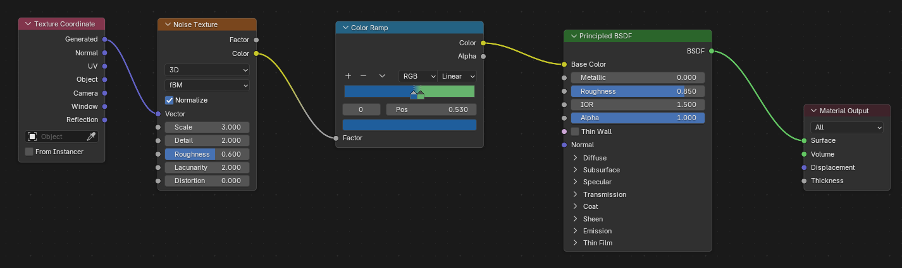
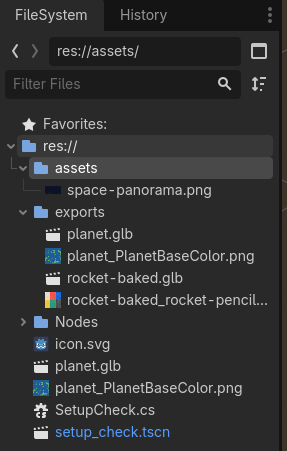

# Walkthrough images

Images are named for their visible content and grouped by topic. The original pixels are unchanged.

| Directory | Contents |
| --- | --- |
| `setup/` | Project creation and the C# setup check |
| `blender/` | Modelling, materials, rendering, baking, and export |
| `godot/` | Import previews, scene construction, and collision settings |
| `simulation/` | Script configuration, experiment states, collision, and trajectory history |
| `diagrams/` | Explanatory drawings of the material graph and fin array |
| `reference/` | Design inspiration and the explicitly labelled older examples below |

## Procedural material variation

The rehearsal graph connects the Noise Texture's **yellow Color output** to Color Ramp Factor. Blender converts the colour to a scalar. The walkthrough and material helper use the **gray Factor output** instead, so this screenshot is retained as a variation rather than the primary wiring reference.

The main walkthrough shows the completed preview as an example of the visual style, with a caption identifying this variation. Its [Factor-based diagram](diagrams/planet-factor-material-flow.svg) defines the recipe to follow.

## Earlier Godot folder layout

This capture predates the current `assets/models/` and `assets/sky/` layout. It also shows duplicated test imports and extracted image files. It is retained for reference and is not used as the folder-layout guide in the walkthrough.

## Other interpretation notes

- The illustrated solar system and rocket are design references, not expected workshop results.
- The setup dialog still shows an earlier project path and Git metadata. Follow the current student-folder path and metadata setting in the text.
- The joined-rocket screenshot shows only the export mesh in an earlier file. Keep the editable source collection as described in A4.
- The World node screenshot and Blender render use a different sky image. Their captions distinguish the node wiring and example composition from the supplied panorama.
- The rocket editor screenshot includes coloured transform-gizmo arcs. It is not a runtime collision-debug capture.
- The placement HUD belongs to C2 before launch. The flight HUD with thrust enabled belongs to C4, not the gravity-only experiment in C3.
- The trajectory image shows visited positions during an example run. It does not establish a particular analytic orbit or predict future motion.
- Original `img_12.png` was byte-identical to `img_11.png`. Both now refer to the single untextured-rocket image.

## Image index

This table records each original filename and its new location. It also identifies the section where its contents are used.

| Original | Image | Placement |
| --- | --- | --- |
| `img.png` | [setup/godot-create-project.png](setup/godot-create-project.png) | Setup: create the Godot project |
| `img_1.png` | [setup/godot-attach-csharp-script.png](setup/godot-attach-csharp-script.png) | Setup: attach SetupCheck.cs |
| `img_2.png` | [setup/godot-csharp-setup-output.png](setup/godot-csharp-setup-output.png) | Setup: verify the output |
| `img_3.png` | [reference/colored-pencil-planet-inspiration.png](reference/colored-pencil-planet-inspiration.png) | A2: choose a planet palette |
| `img_4.png` | [reference/colored-pencil-rocket-inspiration.png](reference/colored-pencil-rocket-inspiration.png) | A3: rocket design reference |
| `img_5.png` | [blender/planet-sphere-dimensions.png](blender/planet-sphere-dimensions.png) | A2: model the sphere |
| `img_6.png` | [blender/planet-new-material.png](blender/planet-new-material.png) | A2: create the material |
| `img_7.png` | [blender/planet-procedural-material-preview.png](blender/planet-procedural-material-preview.png) | A2: optional recorded material variation |
| `img_8.png` | [reference/planet-noise-color-output-variation.png](reference/planet-noise-color-output-variation.png) | Image notes: procedural material variation |
| `img_9.png` | [blender/rocket-primitives-and-unshaped-fin.png](blender/rocket-primitives-and-unshaped-fin.png) | A3: create the primitives |
| `img_10.png` | [blender/apply-object-scale-menu.png](blender/apply-object-scale-menu.png) | A3: apply scale |
| `img_11.png` | [blender/rocket-untextured-fins.png](blender/rocket-untextured-fins.png) | A3: completed rocket geometry |
| `img_13.png` | [blender/rocket-atlas-material-nodes.png](blender/rocket-atlas-material-nodes.png) | A4: create the shared image material |
| `img_14.png` | [blender/rocket-textured-uv-result.png](blender/rocket-textured-uv-result.png) | A4: inspect the UV result |
| `img_15.png` | [blender/rocket-joined-export-transforms.png](blender/rocket-joined-export-transforms.png) | A4: inspect the joined export object |
| `img_16.png` | [blender/showcase-world-shader-context.png](blender/showcase-world-shader-context.png) | A5: switch to World shading |
| `img_17.png` | [blender/showcase-environment-node-connections.png](blender/showcase-environment-node-connections.png) | A5: connect the environment texture |
| `img_18.png` | [blender/showcase-planet-rocket-render.png](blender/showcase-planet-rocket-render.png) | A5: render result |
| `img_19.png` | [blender/planet-existing-uv-map.png](blender/planet-existing-uv-map.png) | A6: check the UV map |
| `img_20.png` | [blender/planet-diffuse-color-only-bake.png](blender/planet-diffuse-color-only-bake.png) | A6: configure the bake |
| `img_21.png` | [blender/planet-save-baked-image-menu.png](blender/planet-save-baked-image-menu.png) | A6: save the baked image |
| `img_22.png` | [blender/planet-baked-image-base-color.png](blender/planet-baked-image-base-color.png) | A6: switch to the baked image |
| `img_23.png` | [blender/export-gltf-menu.png](blender/export-gltf-menu.png) | A7: open the glTF exporter |
| `img_24.png` | [godot/import-preview-baked-planet.png](godot/import-preview-baked-planet.png) | A7: check the baked planet import |
| `img_25.png` | [godot/import-preview-textured-rocket.png](godot/import-preview-textured-rocket.png) | A7: check the rocket import |
| `img_26.png` | [reference/godot-legacy-import-folders.png](reference/godot-legacy-import-folders.png) | Image notes: earlier folder layout |
| `img_27.png` | [godot/window-viewport-size.png](godot/window-viewport-size.png) | B1: window settings |
| `img_28.png` | [godot/environment-panorama-sky.png](godot/environment-panorama-sky.png) | B1: create the sky |
| `img_29.png` | [godot/environment-ambient-light.png](godot/environment-ambient-light.png) | B1: ambient light |
| `img_30.png` | [godot/main-sky-and-status-preview.png](godot/main-sky-and-status-preview.png) | B1: run the empty game area |
| `img_31.png` | [godot/main-camera-environment-hud-tree.png](godot/main-camera-environment-hud-tree.png) | B1: completed game-area scene tree |
| `img_32.png` | [godot/planet-sphere-collider-radius.png](godot/planet-sphere-collider-radius.png) | B2: planet collider |
| `img_33.png` | [godot/planet-collision-layer-mask.png](godot/planet-collision-layer-mask.png) | B2: planet collision filtering |
| `img_34.png` | [godot/planet-wrapper-scene-tree.png](godot/planet-wrapper-scene-tree.png) | B2: planet scene hierarchy |
| `img_35.png` | [godot/rocket-collision-layer-mask.png](godot/rocket-collision-layer-mask.png) | B3: rocket collision filtering |
| `img_36.png` | [godot/rocket-floating-motion-mode.png](godot/rocket-floating-motion-mode.png) | B3: rocket motion mode |
| `img_37.png` | [godot/rocket-wrapper-orientation-preview.png](godot/rocket-wrapper-orientation-preview.png) | B3: rocket hierarchy and orientation |
| `img_38.png` | [godot/main-planet-rocket-editor.png](godot/main-planet-rocket-editor.png) | B4: place the scene instances |
| `img_39.png` | [godot/main-stationary-game-preview.png](godot/main-stationary-game-preview.png) | B4: run Main before scripting |
| `img_40.png` | [godot/orbit-input-map.png](godot/orbit-input-map.png) | B5: input actions |
| `img_41.png` | [simulation/rocket-orbit-csharp-editor.png](simulation/rocket-orbit-csharp-editor.png) | C1: add RocketOrbit.cs |
| `img_42.png` | [simulation/rocket-planet-status-references.png](simulation/rocket-planet-status-references.png) | C1: wire scene references |
| `img_43.png` | [simulation/straight-line-gravity-thrust-disabled.png](simulation/straight-line-gravity-thrust-disabled.png) | C2: disable both accelerations |
| `img_44.png` | [simulation/placement-initial-velocity-hud.png](simulation/placement-initial-velocity-hud.png) | C2: inspect the initial state |
| `img_45.png` | [simulation/gravity-only-settings.png](simulation/gravity-only-settings.png) | C3: enable central gravity |
| `img_46.png` | [simulation/gravity-and-thrust-enabled.png](simulation/gravity-and-thrust-enabled.png) | C4: enable rocket control |
| `img_47.png` | [simulation/collision-stopped-hud.png](simulation/collision-stopped-hud.png) | C5: stop on collision |
| `img_48.png` | [simulation/flight-with-thrust-controls-enabled.png](simulation/flight-with-thrust-controls-enabled.png) | C4: observe flight and control state |
| `img_49.png` | [simulation/trail-rocket-reference.png](simulation/trail-rocket-reference.png) | Optional trajectory: wire OrbitTrail |
| `img_50.png` | [simulation/trajectory-history-game-preview.png](simulation/trajectory-history-game-preview.png) | Optional trajectory: running result |
| `planet-material-overview.svg` | [diagrams/planet-factor-material-flow.svg](diagrams/planet-factor-material-flow.svg) | A2: connect the material graph |
| `three-fin-array.svg` | [diagrams/rocket-three-fin-array.svg](diagrams/rocket-three-fin-array.svg) | A3: radial fin array |
| `img_12.png` | [blender/rocket-untextured-fins.png](blender/rocket-untextured-fins.png) | Duplicate of img_11.png; one copy retained |
